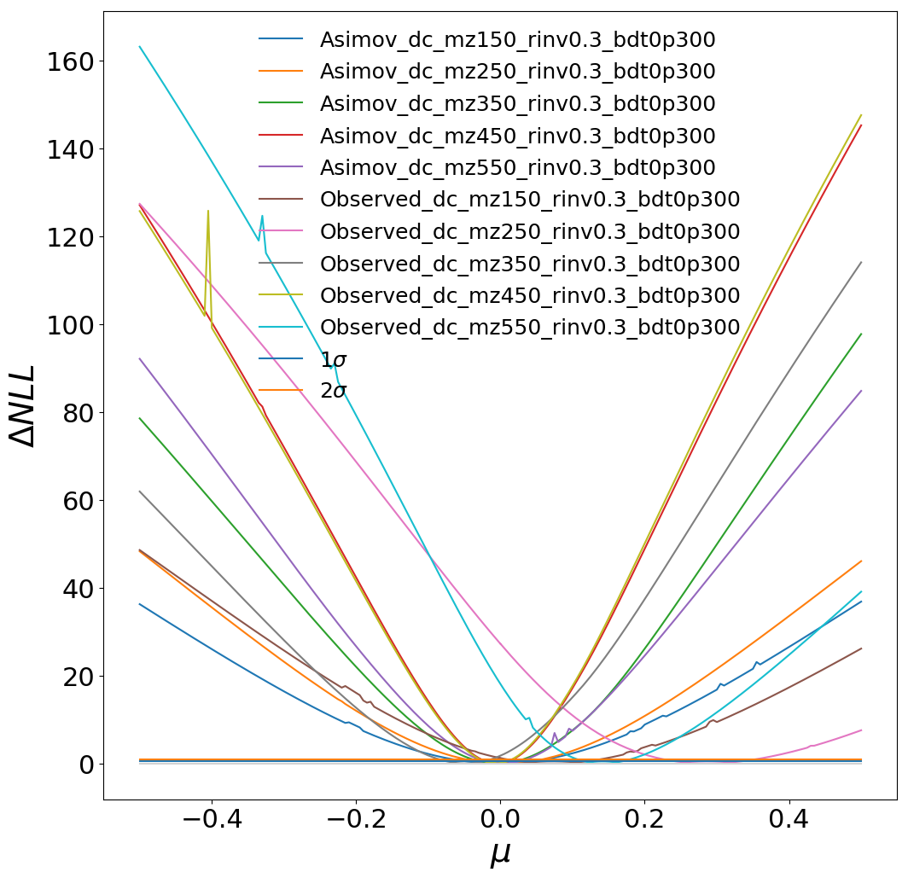
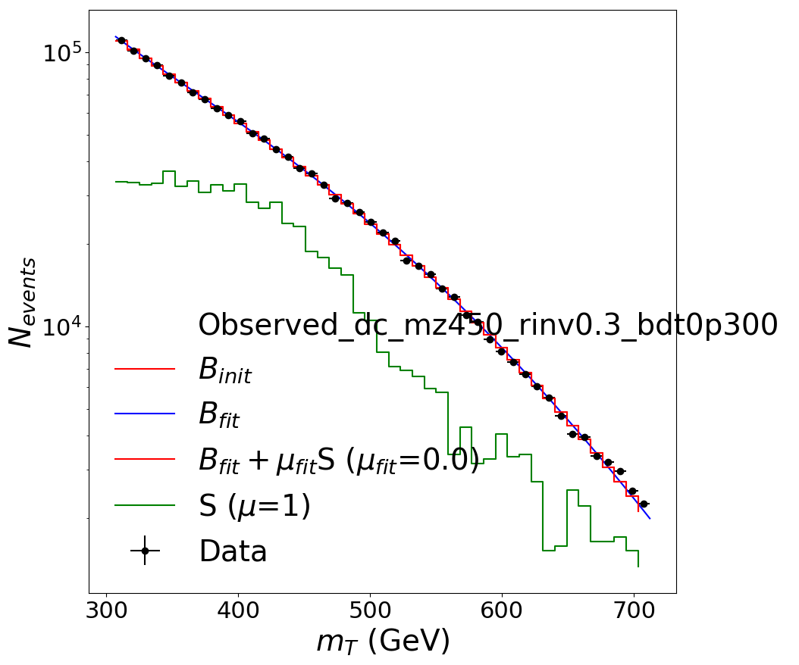
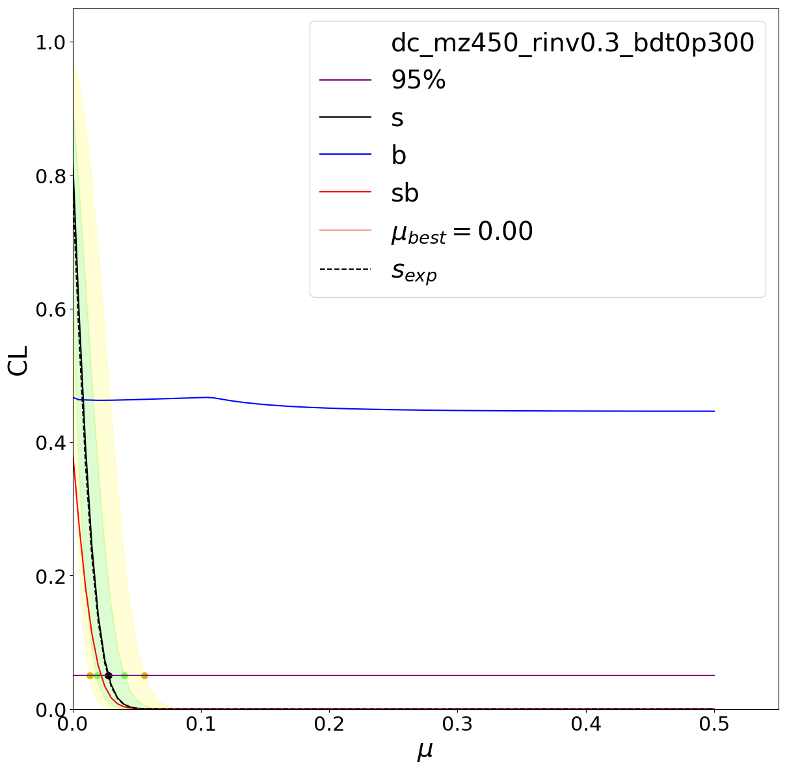
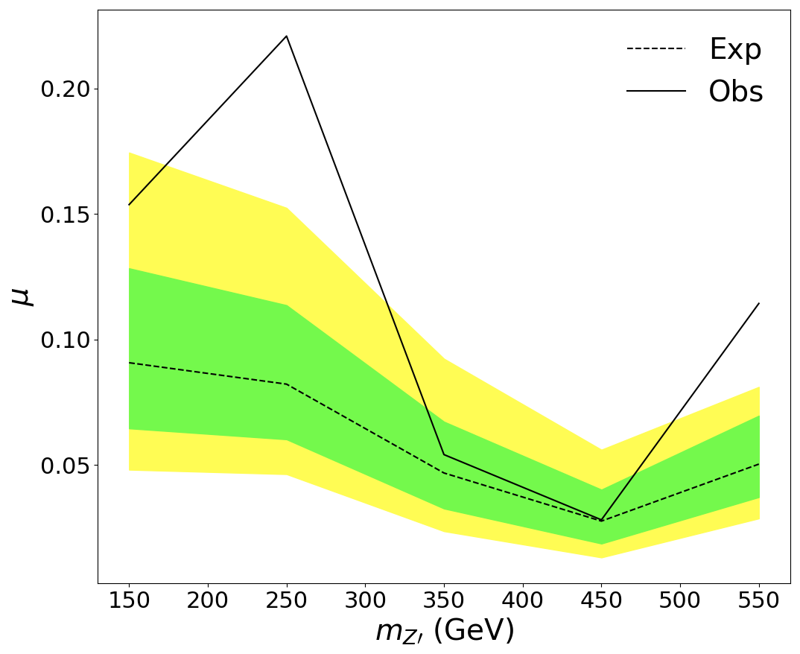

# Limits for the SVJ boosted analysis

## Setup 

1. Follow the `combine` instructions: https://cms-analysis.github.io/HiggsAnalysis-CombinedLimit/#setting-up-the-environment-and-installation .
Current results are using release `CMSSW_11_3_4`, tag v9.1.0.

2. Clone this repository:

```bash
cd $CMSSW_BASE/src
git clone git@github.com:boostedsvj/svj_limits.git boosted/svj_limits
cd boosted/svj_limits
```

The code currently assumes Python 3.
For convenience, you can do:

```bash
alias python=python3
```

The commands below assume you are using this alias; if you're not, replace `python` with `python3`.


## Generating the datacards

You first need a `histograms.json` file; see https://github.com/boostedsvj/svj_uboost .

Then:

```bash
python cli_boosted.py gen_datacards_mp histograms_Mar14.json
python cli_boosted.py gen_datacards --bkg cutbased/merged_20240920/bkg_sel-cutbased.json --sig cutbased/smooth_20240920/SVJ_s-channel_mMed-350_mDark-10_rinv-0p3_alpha-peak_MADPT300_13TeV-madgraphMLM-pythia8_sel-cutbased_smooth.json
for SIGNAL in cutbased/smooth_20240920/SVJ_s-channel_mMed-*_mDark-10_rinv-0p3*.json; do python cli_boosted.py gen_datacards --bkg cutbased/merged_20240920/bkg_sel-cutbased.json --sig $SIGNAL; done
```

## Running the likelihood scans

For all BDT working points and all signals, do simply:

```bash
python cli_boosted.py likelihood_scan dc_20240920_cutbased/dc_SVJ_s-channel_mMed-450_mDark-10_rinv-0p3_alpha-peak_MADPT300_13TeV-madgraphMLM-pythia8_sel-cutbased_smooth.txt
python cli_boosted.py likelihood_scan dc_20240920_cutbased/dc_SVJ_s-channel_mMed-450_mDark-10_rinv-0p3_alpha-peak_MADPT300_13TeV-madgraphMLM-pythia8_sel-cutbased_smooth.txt --asimov
python cli_boosted.py likelihood_scan_mp dc_20240920_cutbased/dc_SVJ_s-channel_mMed-*_mDark-10_rinv-0p3_alpha-peak_MADPT300_13TeV-madgraphMLM-pythia8_sel-cutbased_smooth.txt 
python cli_boosted.py likelihood_scan_mp dc_20240920_cutbased/dc_SVJ_s-channel_mMed-*_mDark-10_rinv-0p3_alpha-peak_MADPT300_13TeV-madgraphMLM-pythia8_sel-cutbased_smooth.txt --asimov
```

Selecting BDT working points and particular signals is easily done via wildcard patterns to select the right datacards, e.g.:

```bash
python cli_boosted.py likelihood_scan dc_Dec07_minmt300/dc_mz*rinv0.3*bdt0p{0,3,5}*.txt --asimov --minmu -.5 --maxmu .5 -n 100
```

Note also the options `--minmu` and `--maxmu` which handle the range of the signal parameter to scan, and the option `-n` which controls the number of points in the range.


## Plotting
## Bias study

Generate toys:

```
python cli_boosted.py gentoys dc_20241010_cutbased/dc_SVJ_s-channel_mMed-200_mDark-10_rinv-0p3_alpha-peak_MADPT300_13TeV-madgraphMLM-pythia8_sel-cutbased_smooth.txt -t 300 --expectSignal 0 -s 1001 --rMin -5 --rMax 5
for DC in dc_20241010_cutbased/*.txt; do python cli_boosted.py gentoys $DC -t 300 --expectSignal 0 -s 1001 --rMin -5 --rMax 5 --seed 1001 --pdf main; done
```

Fit the toys:

```
python cli_boosted.py fittoys dc_20240920_cutbased/dc_SVJ_s-channel_mMed-350_mDark-10_rinv-0p3_alpha-peak_MADPT300_13TeV-madgraphMLM-pythia8_sel-cutbased_smooth.txt --toysFile toys_20240924/higgsCombineObserveddc_SVJ_s-channel_mMed-350_mDark-10_rinv-0p3_alpha-peak_MADPT300_13TeV-madgraphMLM-pythia8_sel-cutbased_smooth.GenerateOnly.mH120.1001.root --expectSignal 0 --rMin -5 --rMax 5 --cminDefaultMinimizerStrategy 0
 
for MZ in 200 250 300 350 400 450 500 550; do python cli_boosted.py fittoys dc_20241010_cutbased/dc_SVJ_s-channel_mMed-$MZ*.txt --toysFile toys_20241010/higgsCombineObserveddc_SVJ_s-channel_mMed-$MZ*.root --expectSignal 0 --rMin -5 --rMax 5 --cminDefaultMinimizerStrategy=0 --pdf ua2; done
```


To do all plots at once (takes a while):

```bash
python quick_plot.py allplots scans_Dec07/*.root
```


ΔNNL as a function of mu:

```bash
python quick_plot.py muscan scans_Dec07/*bdt0p3*Scan*.root
```

Updated upstream


Fit to background distribution:
```bash
python3 quick_plot.py bkgfit ua2 --bkg cutbased/merged_20240920/bkg_sel-cutbased.json --sig cutbased/smooth_20240920/SVJ_s-channel_mMed-350_mDark-10_rinv-0p3_alpha-peak_MADPT300_13TeV-madgraphMLM-pythia8_sel-cutbased_smooth.json --outfile fit_bkg.png
```

MT histogram, with bkg-only fit and and sig+bkg fit:

```bash
python quick_plot.py mtdist scans_Dec07/higgsCombineObserved_dc_mz450_rinv0.3_bdt0p300Bestfit.MultiDimFit.mH120.root
```

Note you should use the `Bestfit`-tagged file, not `Scan`.
Apparently, the single snapshot stored in the `Scan` files is _not_ the best fit.





CLS:

```bash
python quick_plot.py cls scans_Dec07/higgsCombineObserved_dc_mz450_rinv0.3_bdt0p300.MultiDimFit.mH120.root scans_Dec07/higgsCombineAsimov_dc_mz450_rinv0.3_bdt0p300.MultiDimFit.mH120.root

for MZ in 200 250 300 350 400 450 500 550; do python quick_plot.py cls scans_20241009/higgsCombineObserveddc_SVJ_s-channel_mMed-$MZ*_mDark-10_rinv-0p3_alpha-peak_MADPT300_13TeV-madgraphMLM-pythia8_sel-cutbased_smoothScan.MultiDimFit.mH120.root scans_20241009/higgsCombineAsimovdc_SVJ_s-channel_mMed-$MZ*_mDark-10_rinv-0p3_alpha-peak_MADPT300_13TeV-madgraphMLM-pythia8_sel-cutbased_smoothScan.MultiDimFit.mH120.root --clean; done
```




Brazil band (relies on good interpolation; always check the CLs plots to double check!):

```bash
python quick_plot.py brazil scans_Dec07/higgsCombine*bdt0p3*.root
```


